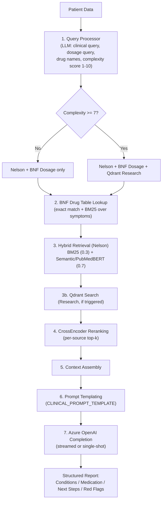

# MedXup — Pediatric Clinical Decision Support System

MedXup is an AI-powered clinical decision support tool for pediatric care. A clinician enters a patient's vitals and presenting symptoms, and the system retrieves relevant evidence from a pediatric textbook, a drug dosing reference, and (for complex cases) research literature, then generates a structured, layered clinical report using an LLM — complete with likely conditions, medication guidance, next steps, and red flags.

---

## Table of Contents

- [Features](#features)
- [Tech Stack](#tech-stack)
- [Architecture](#architecture)
  - [Request flow](#request-flow)
  - [Project Architecture](#project-architecture)
- [Project Structure](#project-structure)
- [Getting Started](#getting-started)
  - [Prerequisites](#prerequisites)
  - [Backend setup](#backend-setup)
  - [Frontend setup](#frontend-setup)
- [Environment Variables](#environment-variables)
- [API Reference](#api-reference)

---

## Features

- **Patient screening form** — captures age, sex, weight, height, vitals (SpO2, temperature, heart rate, blood pressure), and free-text symptoms.
- **Voice-assisted symptom intake** — an LLM-guided conversational voice assistant (multi-language) asks targeted follow-up questions to clarify symptoms before analysis.
- **Multi-database hybrid RAG retrieval:**
  - **Nelson Textbook of Pediatrics** — chunked and embedded in ChromaDB, searched with hybrid BM25 + semantic search.
  - **BNF for Children (BNFC) drug table** — structured Excel-based exact/fuzzy dosage lookups.
  - **Pediatric research papers** — stored in Qdrant, brought in automatically for high-complexity cases.
- **Complexity-based routing** — an LLM scores each case's complexity (1–10); only complex cases (≥7) trigger the extra research-paper retrieval step, keeping routine cases fast.
- **CrossEncoder reranking** — retrieved chunks are reranked for relevance before being sent to the LLM.
- **Streaming clinical reports** — the final report streams token-by-token to the UI via NDJSON over HTTP.
- **Structured 4-section report** — Possible Conditions, Medication Guidance, Next Steps, and Red Flags, each with a "Quick view" and "Clinical detail" layer.
- **PDF export & clinician feedback loop** — generated reports are saved as PDFs; clinicians can rate/comment on reports, logged to `feedback.csv`.

## Tech Stack

**Frontend**
- React 18 + TypeScript + Vite
- Tailwind CSS + shadcn/ui (Radix primitives)
- React Router, TanStack Query, React Hook Form + Zod
- `jsPDF` / `html2canvas` for PDF report generation
- Browser Speech Recognition API for the voice assistant

**Backend**
- FastAPI (Python) served by Uvicorn
- Azure OpenAI (GPT-series deployment) for query analysis, complexity scoring, and clinical report generation
- `sentence-transformers` (PubMedBERT — `pritamdeka/S-PubMedBert-MS-MARCO`) for embeddings
- ChromaDB — vector store for the Nelson textbook
- Qdrant — vector store for research papers
- `rank-bm25` for lexical search (hybrid retrieval)
- CrossEncoder (`cross-encoder/ms-marco-MiniLM-L-6-v2`) reranker
- Pandas/OpenPyXL-based lookup over a merged BNF drug-dosing Excel table

## Architecture

### Request flow

1. **Screening (`/screening`)** — the clinician fills in patient demographics, vitals, and symptoms. The **VoiceAssistant** component can optionally drive a spoken conversation (via `/voice-llm`) to collect and clarify symptom text before submission.
2. **Submit for analysis** — the frontend calls `POST /analyze-stream` (streaming) or `POST /analyze` (single response) with the patient payload.
3. **Backend orchestration** — `app.py` delegates to `ClinicalAnalyzer`, which preprocesses the patient data (BMI calculation, BP formatting) and hands off to `RAGEngine`.
4. **Report rendering (`/report`)** — the frontend streams NDJSON chunks (`meta` → `chunk`* → `done`), rendering the report live via `ClinicalReportDisplay`, then offers PDF export (`reportGenerator.ts` + `jsPDF`/`html2canvas`).
5. **Persistence & feedback** — the rendered PDF is POSTed to `/save-report`; clinicians can rate the report via `/submit-feedback`, which is appended to `feedback.csv` (with an Excel hyperlink back to the saved PDF).

### Project Architecture

The `RAGEngine` (`src/rag_engine.py`) runs the following steps for every case:



## Project Structure

```
.
├── backend/
│   ├── app.py                     # FastAPI app & API routes
│   ├── config.py                  # Config, prompt template, env validation
│   ├── setup_and_index.py         # Indexes research paper JSON into ChromaDB
│   ├── scripts/
│   │   ├── index_bnf.py           # Builds/refreshes the BNF drug table
│   │   ├── index_nelson.py        # Indexes the Nelson textbook into ChromaDB
│   │   └── test_nelson_search.py
│   ├── src/
│   │   ├── rag_engine.py          # Orchestrates the full RAG pipeline
│   │   ├── clinical_analyzer.py   # Preprocessing + pipeline entry point
│   │   ├── query_processor.py     # LLM query generation & complexity scoring
│   │   ├── hybrid_retriever.py    # BM25 + semantic hybrid search (Nelson)
│   │   ├── qdrant_retriever.py    # Research paper retrieval (Qdrant)
│   │   ├── drug_table_lookup.py   # BNF dosage table lookup
│   │   ├── reranker.py            # CrossEncoder reranking
│   │   ├── vector_store.py        # ChromaDB wrapper
│   │   ├── embedding_service.py   # PubMedBERT embeddings
│   │   ├── document_processor.py  # Research JSON → chunks
│   │   ├── extractors/            # PDF/text extraction utilities
│   │   ├── chunkers/              # Chunking strategies
│   │   └── data/                  # Local data assets
│   ├── requirements.txt
│   ├── runtime.txt
│   └── Procfile
│
└── frontend/
    ├── src/
    │   ├── pages/
    │   │   ├── Landing.tsx
    │   │   ├── Signup.tsx
    │   │   ├── Onboarding.tsx
    │   │   ├── Screening.tsx      # Patient intake form + voice assistant
    │   │   ├── Report.tsx         # Streamed report view + PDF export
    │   │   └── NotFound.tsx
    │   ├── components/
    │   │   ├── voice/VoiceAssistant.tsx
    │   │   ├── report/ClinicalReportDisplay.tsx
    │   │   ├── layout/            # Navbar, Sidebar, Footer, Disclaimer
    │   │   └── ui/                # shadcn/ui component library
    │   ├── lib/
    │   │   ├── reportGenerator.ts # PDF generation (jsPDF/html2canvas)
    │   │   └── demoSession.ts
    │   └── hooks/
    ├── vite.config.ts             # Dev server + API proxy to backend
    ├── tailwind.config.js
    └── package.json
```

## Getting Started

### Prerequisites

- Python 3.9+
- Node.js 18+ and npm
- An Azure OpenAI resource with a deployed chat model
- A running Qdrant instance (optional — enables the research-paper retrieval tier; the app degrades gracefully without it)

### Backend setup

```bash
cd backend
python -m venv venv
source venv/bin/activate      # Windows: venv\Scripts\activate
pip install -r requirements.txt

cp .env.template .env         # create if not present; see Environment Variables below
# fill in AZURE_OPENAI_* values

python app.py                 # runs on http://localhost:8000
```

API docs are auto-generated by FastAPI at `http://localhost:8000/docs`.

### Frontend setup

```bash
cd frontend
npm install
npm run dev                   # runs on http://localhost:5173, proxies API calls to :8000
```

For production, `npm run build` outputs to `frontend/dist`; when this folder exists, the FastAPI backend serves it directly (see the static-file mount at the bottom of `app.py`), so a single backend process can serve both the API and the built UI.

## Environment Variables

Create a `.env` file inside `backend/`:

| Variable | Description |
|---|---|
| `AZURE_OPENAI_ENDPOINT` | Azure OpenAI resource endpoint URL |
| `AZURE_OPENAI_API_KEY` | Azure OpenAI API key |
| `AZURE_OPENAI_DEPLOYMENT_NAME` | Name of the deployed chat model |
| `AZURE_OPENAI_API_VERSION` | API version (defaults to `2024-02-15-preview`) |
| `QDRANT_URL` | Qdrant instance URL (defaults to `http://localhost:6333`) |
| `QDRANT_COLLECTION` | Qdrant collection name (defaults to `pediatric_research`) |

## API Reference

| Method | Endpoint | Description |
|---|---|---|
| `GET` | `/health` | Service health, model info, and indexed document counts. |
| `POST` | `/analyze` | Full patient analysis, returns the complete report in one response. |
| `POST` | `/analyze-stream` | Same pipeline, streamed as NDJSON (`meta` → `chunk`* → `done`). |
| `POST` | `/voice-llm` | Server-controlled voice assistant turn — asks the next clarifying question or returns captured symptoms as JSON. |
| `POST` | `/save-report` | Persists a client-generated PDF report to disk. |
| `POST` | `/submit-feedback` | Records/updates a clinician's rating and comment for a report in `feedback.csv`. |
