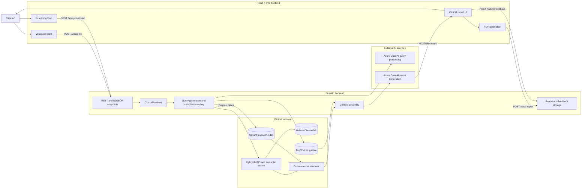

# MedXup

MedXup is an AI-assisted pediatric clinical decision-support prototype. It combines patient screening data with pediatric textbook content, structured BNF for Children dosing data, and research-paper retrieval to generate a streamed clinical report for professional review.

> **Clinical disclaimer:** MedXup is a decision-support prototype, not a medical device and not a substitute for independent clinical judgement. Its recommendations, risk labels, calculations, citations, and medicine doses must be validated by a qualified clinician before use.

## Features

- Guided pediatric screening for demographics, measurements, vital signs, symptoms, and history
- Multilingual browser voice assistant for collecting symptoms
- Hybrid Nelson textbook retrieval using BM25 and PubMedBERT embeddings
- Structured pediatric medicine lookup from a local BNFC-derived table
- Optional Qdrant research retrieval for complex presentations
- Cross-encoder reranking and Azure OpenAI report generation
- Streaming clinical reports with evidence metadata
- Browser-generated PDF reports and clinician feedback capture

## Reference book

[BNF for Children (Google Drive)](https://drive.google.com/file/d/1GOe0-RFTVDtvr7Ffbb6EMFUw3jvMmHx6/view?usp=sharing)

Only use and distribute the referenced book if you have the necessary permission or licence. The book, extracted content, generated indexes, and patient reports should not be committed to this repository.

## Architecture



## Repository structure

```text
.
|-- backend/
|   |-- app.py                 # FastAPI application and API routes
|   |-- config.py              # Paths, models, prompts, and retrieval settings
|   |-- requirements.txt       # Python dependencies
|   |-- scripts/               # Dataset indexing and search utilities
|   `-- src/                   # RAG, retrieval, parsing, and analysis modules
|-- frontend/
|   |-- src/components/        # Layout, report, voice, and UI components
|   |-- src/pages/             # Landing, onboarding, screening, and report pages
|   `-- vite.config.ts         # Vite build and development proxy
|-- reports/                   # Generated locally; ignored by Git
`-- feedback.csv               # Generated locally; ignored by Git
```

Large datasets, vector databases, medicine tables, generated reports, credentials, installed dependencies, and build output are intentionally excluded by `.gitignore`.

## Prerequisites

- Python 3.10 or 3.11 recommended
- Node.js 18 or newer
- An Azure OpenAI resource and deployment
- Local Nelson ChromaDB data
- A structured BNFC workbook at `backend/data/merged_drug_table.xlsx`
- Optional Qdrant service and indexed research collection

## Backend setup

From PowerShell:

```powershell
cd backend
python -m venv .venv
.\.venv\Scripts\Activate.ps1
python -m pip install --upgrade pip
pip install -r requirements.txt
pip install openpyxl tiktoken qdrant-client azure-ai-formrecognizer azure-core
```

Create `backend/.env` locally:

```dotenv
AZURE_OPENAI_ENDPOINT=https://your-resource.openai.azure.com/
AZURE_OPENAI_API_KEY=replace-me
AZURE_OPENAI_DEPLOYMENT_NAME=replace-me
AZURE_OPENAI_API_VERSION=2024-02-15-preview

# Optional document extraction
AZURE_DOC_INTELLIGENCE_ENDPOINT=
AZURE_DOC_INTELLIGENCE_KEY=

# Optional research retrieval
QDRANT_URL=http://localhost:6333
QDRANT_COLLECTION=pediatric_research
```

Never place Azure credentials in frontend `VITE_*` variables: Vite can expose referenced values in the browser bundle.

Start the API:

```powershell
cd backend
uvicorn app:app --reload --host 127.0.0.1 --port 8000
```

The API documentation is available at `http://127.0.0.1:8000/docs`.

## Frontend setup

In a second terminal:

```powershell
cd frontend
npm ci
npm run dev
```

Open `http://localhost:5173`. During development, Vite proxies API requests to `http://127.0.0.1:8000`.

## Production build

```powershell
cd frontend
npm ci
npm run build
cd ..\backend
uvicorn app:app --host 0.0.0.0 --port 8000
```

When `frontend/dist` exists, FastAPI serves the built single-page application alongside the API.

## Main API routes

| Method | Route | Purpose |
| --- | --- | --- |
| `GET` | `/health` | Service and index status |
| `GET` | `/stats` | Retrieval-system statistics |
| `POST` | `/analyze` | Non-streaming clinical analysis |
| `POST` | `/analyze-stream` | NDJSON-streamed clinical analysis |
| `POST` | `/voice-llm` | Server-side voice-assistant LLM call |
| `POST` | `/save-report` | Save a generated PDF locally |
| `POST` | `/submit-feedback` | Save or update clinician feedback |

## Development checks

```powershell
python -m compileall -q backend
cd frontend
npm exec tsc -- --noEmit
npm run lint
npm run build
npm audit --omit=dev
```

The current prototype still has TypeScript, lint-configuration, dependency, security, and clinical-validation work to complete before deployment.

## Data and security

- Do not commit `.env` files, API keys, patient reports, feedback, or identifiable clinical data.
- Use only de-identified test cases during development.
- Add authentication, authorization, rate limiting, encrypted storage, retention rules, and an audit trail before exposing the service beyond a controlled development environment.
- Review the applicable medical-device, privacy, copyright, and data-protection requirements for the intended deployment region.

